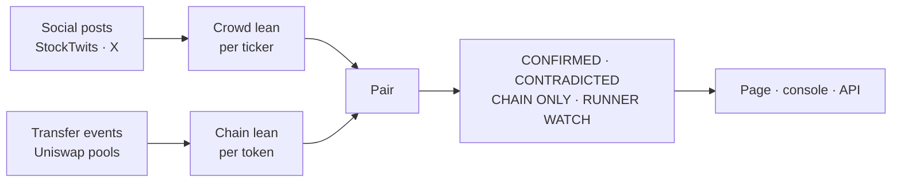

<p align="center">
  
</p>

<p align="center">
  <strong>An AI lie detector for retail.</strong>
</p>

<p align="center">
  Retail says one thing on social. Its wallets do another on chain.<br>
  MEDUSA reads the two against each other, token by token, and says where they disagree.
</p>

<p align="center">
  
  
  
  
  
  
</p>

<p align="center">
  <a href="https://medusa-ai.pro"><strong>medusa-ai.pro</strong></a> ·
  <a href="https://medusa-ai.pro/api/">API</a> ·
  <a href="https://x.com/0x_fokki">@0x_fokki</a>
</p>

---

## The agent

Every day the crowd tells you what it thinks: bullish, bearish, "loading up", "getting out". Every hour the chain tells you what it did. The two rarely match, and the gap between them is the most honest signal retail produces.

MEDUSA is an always-on agent that reads both sides and keeps score. It pulls the loudest calls about the chain's coins from social, reads the last hour of fills straight off Robinhood Chain, and pairs them ticker by ticker. Where words and money agree, she says **CONFIRMED**. Where they point opposite ways, **CONTRADICTED**. Where real buyers pile in while nobody is talking, she raises **RUNNER WATCH**.

> **Words on one side. Money on the other. The verdict is the difference.**

She never trades, never signs, never holds a wallet. Every fill on the page links to its transaction. Every post is quoted as written and links to the original.

## Why this is an AI agent

Not a dashboard, not a sentiment widget. The software runs its own loop, unattended:

1. **Listen** — pull the day's posts about the chain's coins, keep the ones with a clear direction, tag each bullish or bearish and by emotion (greed, fear, FOMO, hopium, cope).
2. **Watch** — read every `Transfer` against the Uniswap pools for the last hour, drop routers and round trips, keep what real wallets ended up with.
3. **Pair** — put the crowd's lean next to the chain's lean for every token with enough of both.
4. **Judge** — score the pair, name the verdict, flag the runners.
5. **Publish** — rewrite the page and the JSON API, every ten minutes, and replay every row on a live console so the reasoning is visible.
6. **Take statements** — anyone can feed her a thought; it lands on the jellyfish and joins the record.

The intelligence is a transparent pairing rule, not an LLM. Every number on the page can be recomputed from the scripts in this repository.

## What she reads



**The chain side is read, not fetched.** `read-chain.mjs` asks the node for every token transfer to or from the pool contracts in the window, nets each wallet's position per transaction, drops counterparties that are contracts, and drops a wallet that bought and sold the same size inside the hour. What is left is people taking positions. DexScreener supplies names and prices only.

**The social side keeps the author's own label when there is one** (StockTwits lets people tag Bullish or Bearish) and reads the rest itself, marking every post it read as `readByMedusa: true` so a reading is never presented as the author's claim.

## How she scores

```
chain lean  = (buyers − sellers) / wallets        last hour, at least 3 wallets
crowd lean  = (bull − bear) / tagged posts         today, at least 2 posts
score       = (chain lean + crowd lean) / 2 × 100  or the chain lean alone when the crowd is silent

CONFIRMED      both leans point the same way
CONTRADICTED   they point opposite ways
CHAIN ONLY     fewer than 2 tagged posts to read
RUNNER WATCH   chain lean ≥ 0.5 across ≥ 5 wallets, with the crowd not against it
```

RUNNER WATCH is not a price call. It marks where money is concentrating right now while the crowd is quiet, and nothing more.

## What the board looked like

Snapshot from **2026-09-17**. The live figures are on the site and in the API; this table is only a record of one moment.

| Metric | Result |
|---|---:|
| Tokens with real wallets in the last hour | 25 |
| Distinct wallets trading | 1,052 |
| Verdicts on the board | 24 |
| Runner watch | 1 |
| Posts read for the day | 978 |
| Kept with a clear direction | 4 |

Most rows were **CHAIN ONLY** that day: the social pull covered the chain's biggest names, and the memecoins that move on chain are rarely the ones people post about by cashtag. That gap is itself the finding, and the page says so rather than filling it in.

## Public API

```
GET https://medusa-ai.pro/api/v1/chain      the last hour: tokens, buyers/sellers, the biggest fills with tx links
GET https://medusa-ai.pro/api/v1/verdicts   chain lean vs crowd lean per token, runners first
GET https://medusa-ai.pro/api/v1/daily      today's posts, the loudest six, bull/bear per ticker
GET https://medusa-ai.pro/api/v1/stats      statements taken, all time and today
GET https://medusa-ai.pro/api/v1/index      what is here
```

Open, no key, CORS for any origin, cached 60 seconds, rewritten every ten minutes. Read-only. The docs page with live responses is at [medusa-ai.pro/api](https://medusa-ai.pro/api/).

## Run it yourself

Requirements: **Node.js 20+**, a browser for Playwright, and a residential connection for the social pull.

```bash
git clone https://github.com/0xfokki/medusa.git
cd medusa
npm install
npx playwright install chromium

node scripts/pull-chain.mjs   # the tracked universe, via DexScreener
node scripts/read-chain.mjs   # the last hour, read off the chain → chain-live.js
node scripts/pull-daily.mjs   # today's social read → daily-data.js
node scripts/build-api.mjs    # the JSON API → api/v1/*

npx serve .                   # the page is one file; any static server will do
```

Optional, and everything degrades without them:

- **X** — `pull-x.mjs` uses the twitterapi.io reseller. Put a key in `.x-key` (gitignored) or `TWITTERAPI_KEY`; without it the daily read runs on StockTwits alone.
- **The thought intake** — `server/thoughts.mjs` is the small service behind "Ask MEDUSA". The page works without it; the counter just stays put.

**StockTwits and DexScreener block data-centre IPs.** The two pulls that touch them have to run from a home connection, and `st-fetch.mjs` will open a visible Chromium window for a minute when a plain fetch is refused. The chain read and the API builder run fine on a server; in production they run from cron.

## Which chain

The chain is one config switch, [`scripts/chains.mjs`](scripts/chains.mjs): RPC and fallbacks, DexScreener slug, explorer, pool manager, quote tokens. Robinhood Chain is the default. Every chain-bound word on the page is filled from the data files, so one `index.html` serves any chain in the config.

## Architecture

| Path | Responsibility |
|---|---|
| [`index.html`](index.html) | The whole page: the jellyfish, daily read, on-chain read, verdict, console |
| [`api.html`](api.html) | The API docs, with live responses |
| [`jelly-lite.js`](jelly-lite.js) | The bell and tentacles on their own, for pages that want her without the hero |
| [`scripts/chains.mjs`](scripts/chains.mjs) | Chain config |
| [`scripts/pull-chain.mjs`](scripts/pull-chain.mjs) | The tracked universe via DexScreener |
| [`scripts/read-chain.mjs`](scripts/read-chain.mjs) | The last hour via `eth_getLogs` against the pools |
| [`scripts/pull-daily.mjs`](scripts/pull-daily.mjs) | The social read; `pull-x.mjs`, `pull-news.mjs`, `st-fetch.mjs` are its parts |
| [`scripts/build-api.mjs`](scripts/build-api.mjs) | The JSON API from the data files, same verdict rule as the page |
| [`server/thoughts.mjs`](server/thoughts.mjs) | The thought intake behind "Ask MEDUSA" |
| `chain-data.js` · `chain-live.js` · `daily-data.js` | The data the page reads, written by the scripts above |

## Trust model

- Nothing on the page is invented. The only simulated thing is the ambient life of the jellyfish, and it is labelled as such in the code.
- Every fill links to its transaction and its wallet on the explorer.
- Every post is quoted as written and links to the original; MEDUSA's own readings are marked as hers.
- The verdict rule is five lines and lives in two places that must agree: the page and the API builder.
- No wallet, no signing, no custody. She reads.

## Limitations

- The social side covers what people post by cashtag. Tokens that move on chain without a crowd around them show as CHAIN ONLY, which is a true statement, not a gap in the data.
- One hour on chain against one day on social is a deliberate pairing of two different windows; a longer social window would dilute today's mood with yesterday's.
- Public RPC endpoints drop log reads under load. `read-chain.mjs` retries across fallbacks; a read that still fails leaves that token out of the hour rather than guessing.
- Wallet counts are distinct addresses. One person with five wallets counts five times; a bot that nets to zero counts zero.
- A verdict is a description of the last hour and today, not a forecast.

## Built on

| Source | Used for |
|---|---|
| [Robinhood Chain documentation](https://docs.robinhood.com/chain/) | RPC access, chain ID 4663 |
| Uniswap v4 PoolManager and v3 pairs | Where a trade is a token moving to or from a pool |
| [DexScreener](https://dexscreener.com) | Names, prices and liquidity for the tracked universe |
| StockTwits, X via twitterapi.io | The crowd's words |

MEDUSA is independent of Robinhood, Uniswap, DexScreener, StockTwits and X and is not endorsed by them. Robinhood Chain is used as a public network.

## License

MIT.
